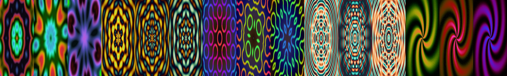

<a href="https://libcsys.github.io/JellyDazzle/"></a>

# JellyDazzle

**An homage to DAZZLE.EXE — the magical DOS kaleidoscope — hand-written in
ARMv9.2-A assembly for Apple Silicon.**

<p align="center"><b><a href="https://libcsys.github.io/JellyDazzle/">▶ &nbsp;Browse the full gallery — 100 patterns · 30 palettes</a></b></p>

> "I spent hours and hours staring at that magical kaleidoscope. Never the
> same pattern, never the same color scheme. It was amazing, and everything
> looked cool." — the reason this exists

Thirty years after the original DOS screensaver, this is a from-scratch
rebuild: every pixel drawn by hand-written ARM64 assembly (`draw.s`), with a
tiny SDL2 shim (`main.c`) standing in for INT 10h and a flat framebuffer.

## A taste of the lab

The ten highest-scoring patterns of the 100-entry catalog — click any tile
for the full frame:

<table>
<tr>
<td align="center"><a href="https://libcsys.github.io/JellyDazzle/#p011"></a><br><sub><b>011</b> Plasma Mandala</sub></td>
<td align="center"><a href="https://libcsys.github.io/JellyDazzle/#p042"></a><br><sub><b>042</b> BZ Pinwheel</sub></td>
<td align="center"><a href="https://libcsys.github.io/JellyDazzle/#p004"></a><br><sub><b>004</b> Mirror Truchet</sub></td>
<td align="center"><a href="https://libcsys.github.io/JellyDazzle/#p019"></a><br><sub><b>019</b> Moiré Silk</sub></td>
<td align="center"><a href="https://libcsys.github.io/JellyDazzle/#p100"></a><br><sub><b>100</b> Pinwheel Swirl</sub></td>
</tr>
<tr>
<td align="center"><a href="https://libcsys.github.io/JellyDazzle/#p018"></a><br><sub><b>018</b> Kefrens Spiral</sub></td>
<td align="center"><a href="https://libcsys.github.io/JellyDazzle/#p067"></a><br><sub><b>067</b> Twin Tunnels</sub></td>
<td align="center"><a href="https://libcsys.github.io/JellyDazzle/#p089"></a><br><sub><b>089</b> Oval Drums</sub></td>
<td align="center"><a href="https://libcsys.github.io/JellyDazzle/#p014"></a><br><sub><b>014</b> Copper Octarings</sub></td>
<td align="center"><a href="https://libcsys.github.io/JellyDazzle/#p064"></a><br><sub><b>064</b> Starburst Forge</sub></td>
</tr>
</table>

**Full catalog: [libcsys.github.io/JellyDazzle](https://libcsys.github.io/JellyDazzle/)**
(mirror: [dazzle.jelia.nyc](https://dazzle.jelia.nyc)) — 100 numbered pattern
prototypes and 30 palettes, built as the expansion roadmap.

## What it does

- **24 drawing routines** on a shuffled wheel — interference kaleidoscopes,
  the radius-sheared *twist*, tunnels, moiré eyes, spirographs that draw
  themselves over 34 seconds, string-art fans, curl gardens, fireworks with
  gravity-drooped spark trails, and more — several reverse-engineered from
  video frames of the original
- **Really random**: avalanche-hashed mode order (no back-to-back repeats),
  random launch seed, random color-scheme pairs every leg
- **30 color schemes**: 6 house palettes + 24 community palettes from
  [Lospec](https://lospec.com) (PICO-8, NES, Apollo, resurrect-64, …)
- **All integer math**: 16-bit interpolated sine tables, fixed point,
  octagonal norms — the way 1994 would have wanted it. ~175 fps at
  1280×960 on an M-series core, single thread

## Download & run (no tools needed)

Grab **JellyDazzle.app.zip** from the
[latest release](https://github.com/LIBCSYS/JellyDazzle/releases), unzip,
and double-click. Apple Silicon Macs only. ESC quits.

> **"Apple could not verify JellyDazzle is free of malware."**
> That is macOS Gatekeeper, not a problem with the app — this is a free
> open-source project without a $99/yr Apple Developer notarization
> certificate. The source is right here; read it, or build it yourself.
>
> To run it, either:
> - **Right-click** the app → **Open** → **Open** (once), or
> - **System Settings → Privacy & Security** → *Open Anyway*, or
> - in Terminal: `xattr -dr com.apple.quarantine /path/to/JellyDazzle.app`
>
> Building from source (below) produces an app with no warning at all.

## The engine vs. the lab

The running app is a 24-routine wheel. The
[gallery](https://libcsys.github.io/JellyDazzle/) is the **expansion
roadmap** — 100 numbered prototypes waiting to be promoted into the assembly
engine, one verified port at a time. Watch the releases: each new version
names the lab numbers it absorbed.

## Build & run

```
brew install sdl2
make run          # builds tables (python3+numpy) + binary, launches
```

`dist/Dazzle.app` is a self-contained bundle (SDL2 inside) — copy it to any
Apple Silicon Mac and double-click. ESC quits.

## The lab

`lab/` holds a 100-entry pattern catalog — each with a runnable Python
prototype, a rendered preview, and an integer-ARM64 porting plan — plus 30
palettes and the research that produced them (frame-by-frame analysis of
original DAZZLE footage, DOS demoscene techniques, kaleidoscope math).
Patterns get promoted from the lab into `draw.s` by number. The
[front page](https://libcsys.github.io/JellyDazzle/) is generated from
`lab/CATALOG.md` by `lab/_pagegen.py`.

## Versions

`builds/` archives every release: `dazzle1.0` (the first "sweet" build)
through the current wheel. `git tag j-favorite` marks the canonical one.

## Credits

- The unknown author of the original **DAZZLE.EXE** — the high-water mark
- [Lospec](https://lospec.com) and its palette artists (palette slugs are
  preserved in `reference/palettes.json` and `lab/palettes/`)
- Built with hand-written assembly, a Makefile, and stubbornness

MIT — see LICENSE.
