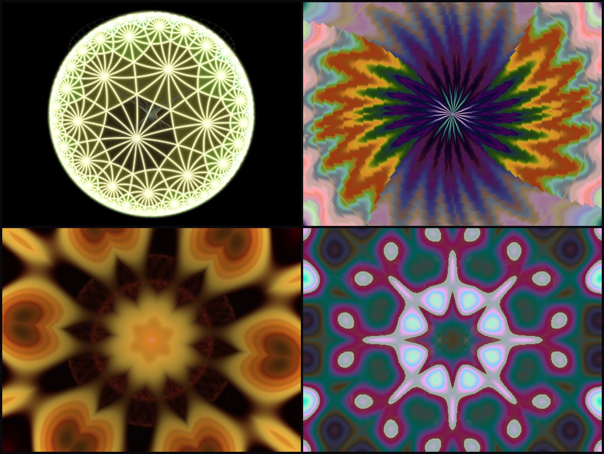
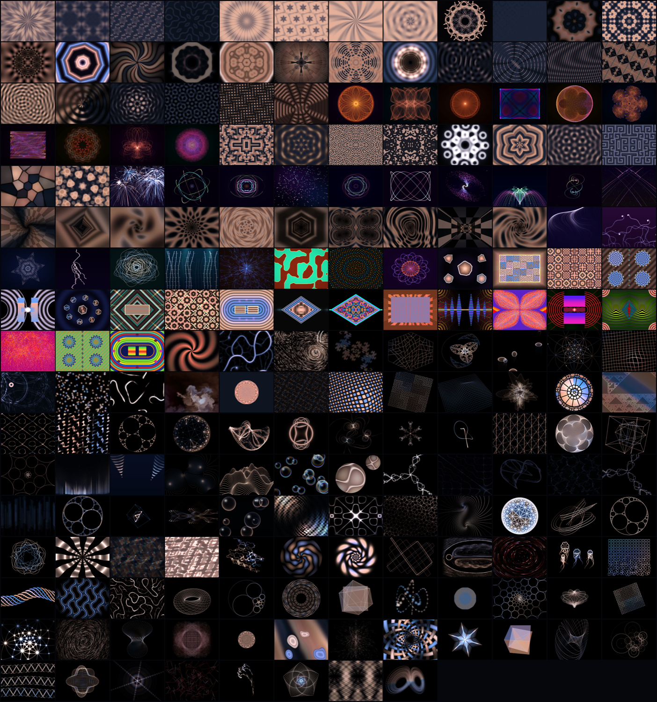

<p align="center">
  <a href="https://dazzle.jelia.nyc">
    
  </a>
</p>

<h1 align="center">JellyDazzle</h1>

<p align="center">
  <b>An homage to DAZZLE.EXE — the magical DOS kaleidoscope —<br>
  rebuilt as a layering engine in ARMv9.2-A assembly and C.</b>
</p>

<p align="center">
  <i>Vibe-coded: human direction and taste, AI execution.</i>
</p>

<p align="center">
  
  
  
  
  
  
</p>

<p align="center">
  <a href="https://github.com/LIBCSYS/JellyDazzle/releases/latest"><b>Download for macOS</b></a> ·
  <a href="https://dazzle.jelia.nyc"><b>Browse all the patterns</b></a> ·
  <a href="HOW_TO_OPEN.md"><b>First-launch help</b></a>
</p>

> [!IMPORTANT]
> ### 🔓 First launch: macOS will block it — 30-second fix, once
>
> macOS says **"Apple could not verify JellyDazzle is free of malware."**
> That is Gatekeeper flagging **any** app without a paid Apple notarization
> certificate. Nothing is wrong with the app — every line of its source is in
> this repo.
>
> | | |
> |---|---|
> | **1** | **Double-click** the app once and let it get refused |
> | **2** | Open **System Settings → Privacy & Security** |
> | **3** | Scroll to the bottom — there's a line: *"JellyDazzle was blocked to protect your Mac"* |
> | **4** | Click **Open Anyway** → confirm with Touch ID or your password |
> | **5** | It launches — and every launch after that is a normal double-click |
>
> **Or the one-liner**, which always works — paste in Terminal after downloading:
>
> ```
> xattr -dr com.apple.quarantine ~/Downloads/JellyDazzle.app
> ```
>
> On macOS 15+ the old "right-click → Open" trick no longer works for unsigned
> apps. A signed, notarized build is coming — then none of this is needed.
> Full walkthrough: **[HOW_TO_OPEN.md](HOW_TO_OPEN.md)**


> "I spent hours and hours staring at that magical kaleidoscope. Never the
> same pattern, never the same color scheme. It was amazing, and everything
> looked cool." — the reason this exists

Thirty years after the DOS screensaver, this is a from-scratch rebuild — and
as of v2.1 it does something the original never did: **it layers.** A routine
opens the frame, a few seconds later a second one fades in over it, then a
third, each on its own clock with its own blend mode and lifetime. What you
watch is the *combination*, and the combinations essentially never recur.

<p align="center">
  <a href="https://dazzle.jelia.nyc">
    
  </a><br>
  <i>The pattern library, one frame each — every tile is a routine that can appear in any layer.</i>
</p>

<p align="center">
  
  <br><i>Layers arriving over one another — the still images above are single frames of this.</i>
</p>

## What it is

- **225 routines** — 24 hand-tuned ARM64 assembly modes plus 201 C plug-ins:
  kaleidoscope symmetries, demoscene classics (plasma, rotozoom, tunnels,
  metaballs, munching squares, copper bars), interference and moiré,
  self-drawing spirographs and harmonographs, cellular and Belousov-Zhabotinsky
  spirals, particle swarms, fireworks, organic growth, and a multicoloured
  lava lamp whose wax drifts over whatever is beneath it
- **Layered composition** — up to four slots (ground, field, figure, spark)
  with staggered entry, alpha envelopes and crossfades. Nothing hard-cuts.
- **Nothing repeats** — shuffled bags rather than dice, re-seeded every launch,
  so a routine plays once before any repeat and no two runs deal the same deck
- **100 colour schemes** — community palettes and designed harmonies, expanded
  into 32,768-entry ramps in **OKLab** along a cyclic **Catmull-Rom** spline:
  no grey midpoints, no plateaus, no hairline banding
- **All integer math in the assembly core** — sine tables, fixed point,
  octagonal norms. The way 1994 would have wanted it.

## How it works

```
main.c ──► jd_frame() ──► scheduler ──► layer slots ──► compositor ──► screen
             (bridge.c)      │             │                │
                             │             │                └── alpha / max / screen
                             │             │                    blends, crossfades
                             │             └── each slot runs one routine:
                             │                 draw.s mode  or  patterns_c/pattern_NNN.c
                             └── shuffled bags, per-run entropy, role-aware picks
```

**The probe.** At startup the engine renders every routine at low resolution
and measures four things: how much of the frame it covers, how bright it is,
how fast it moves, and what it costs. From that it assigns a **role** —
*ground* (can carry a picture), *field*, *figure*, or *spark* (sparse, belongs
on top) — and the scheduler only ever draws a ground layer from routines that
actually emit light. Cost feeds an admission budget so the stack never exceeds
the frame time.

**The plug-in contract** (`jellydazzle.h`) is deliberately tiny:

```c
void pattern_NNN(uint32_t *fb, int w, int h, int frame, int sl,
                 uint32_t seed, const uint32_t *pal);
```

`sl` is the segment-local frame, so accumulator patterns know when to clear
their canvas; `pal` is a 32,768-entry palette the engine has already
crossfaded for you. Drop a file in `patterns_c/`, run `tools/gen_registry.sh`,
and the scheduler picks it up.

**Run any routine on its own:** `JD_MODE=42 ./dazzle64`. Also `JD_LAYERS=n`
to cap the stack and `JD_DEBUG=1` to watch spawns and palette picks.

## Download & run (no tools needed)

Grab **JellyDazzle.app.zip** from the
[latest release](https://github.com/LIBCSYS/JellyDazzle/releases), unzip, and
double-click. **Apple Silicon Macs only.** ESC quits.


## The engine vs. the lab

The running app is a 24-routine wheel. The
[gallery](https://libcsys.github.io/JellyDazzle/) is the **expansion
roadmap** — 100 numbered prototypes waiting to be promoted into the assembly
engine, one verified port at a time. Watch the releases: each new version
names the lab numbers it absorbed.

## Build & run

```
brew install sdl2
make run          # builds tables (python3+numpy) + binary, launches
```

`dist/Dazzle.app` is a self-contained bundle (SDL2 inside) — copy it to any
Apple Silicon Mac and double-click. ESC quits.

## The lab

`lab/` holds a 100-entry pattern catalog — each with a runnable Python
prototype, a rendered preview, and an integer-ARM64 porting plan — plus 30
palettes and the research that produced them (frame-by-frame analysis of
original DAZZLE footage, DOS demoscene techniques, kaleidoscope math).
Patterns get promoted from the lab into `draw.s` by number. The
[front page](https://libcsys.github.io/JellyDazzle/) is generated from
`lab/CATALOG.md` by `lab/_pagegen.py`.

## Versions

`builds/` archives every release: `dazzle1.0` (the first "sweet" build)
through the current wheel. `git tag j-favorite` marks the canonical one.

## Credits

- The unknown author of the original **DAZZLE.EXE** — the high-water mark
- [Lospec](https://lospec.com) and its palette artists (palette slugs are
  preserved in `reference/palettes.json` and `lab/palettes/`)
- **Direction, taste, and quality control:** John Elia (LIBCSystems) — who
  remembered the original, filmed it off a DOS box for reference, and threw
  out every version that didn't feel right
- **Assembly, C, and the 100-pattern lab:** Claude (Anthropic), under that
  direction — including the agent fleet that researched, prototyped, judged,
  and ported every pattern
- Built with a Makefile, an lldb session, and stubbornness

MIT — see LICENSE.
