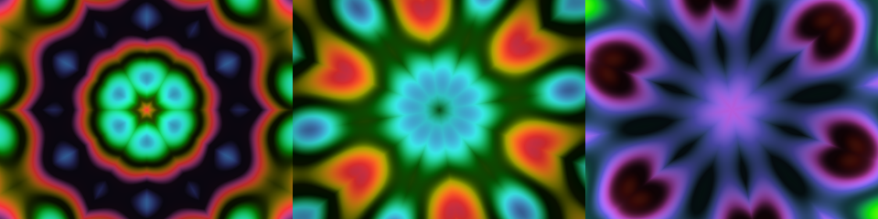
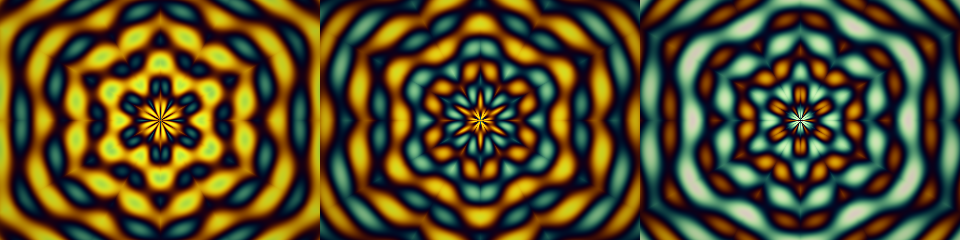
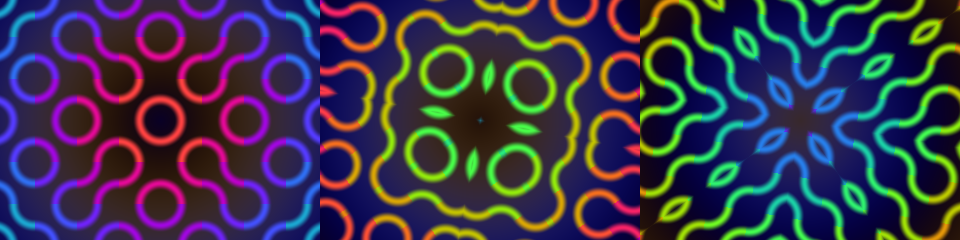
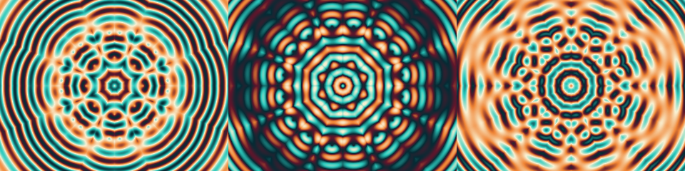
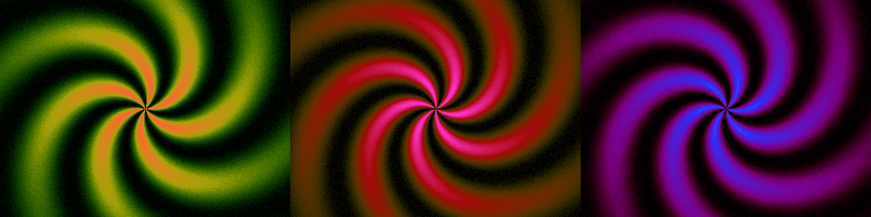
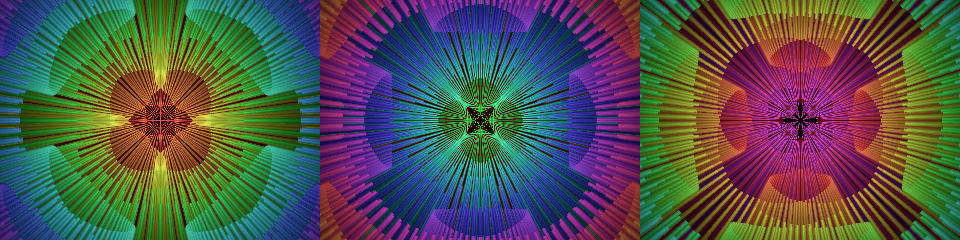
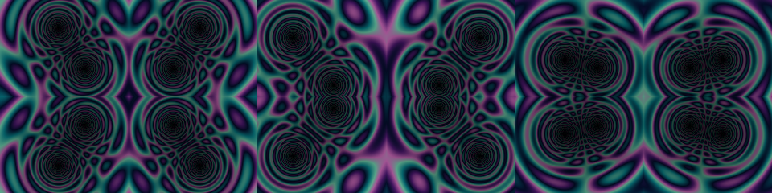
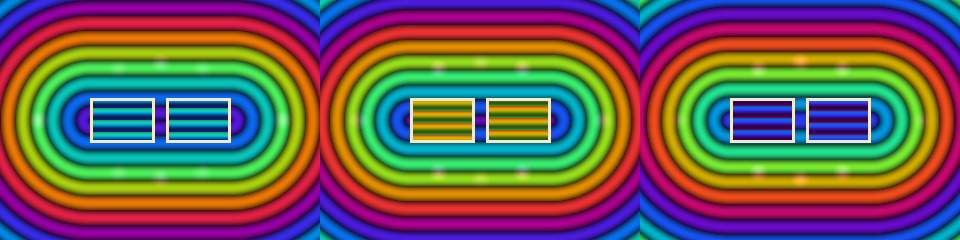
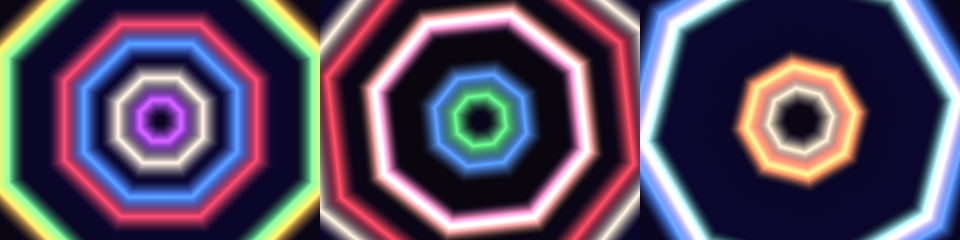
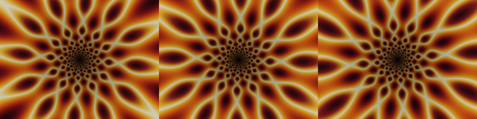

<p align="center">
  <a href="https://libcsys.github.io/JellyDazzle/">
    
  </a>
</p>

<h1 align="center">JellyDazzle</h1>

<p align="center">
  <b>An homage to DAZZLE.EXE — the magical DOS kaleidoscope —<br>
  written in ARMv9.2-A assembly for Apple Silicon.</b>
</p>

<p align="center">
  <i>Vibe-coded: human direction and taste, AI execution.</i>
</p>

<p align="center">
  
  
  
  
  
  
</p>

<p align="center">
  <a href="https://github.com/LIBCSYS/JellyDazzle/releases/latest"><b>Download for macOS</b></a> ·
  <a href="https://dazzle.jelia.nyc"><b>Browse all 100 patterns</b></a> ·
  <a href="HOW_TO_OPEN.md"><b>First-launch help</b></a>
</p>


> "I spent hours and hours staring at that magical kaleidoscope. Never the
> same pattern, never the same color scheme. It was amazing, and everything
> looked cool." — the reason this exists

Thirty years after the original DOS screensaver, this is a from-scratch
rebuild: every pixel drawn by ARM64 assembly (`draw.s`), with a tiny SDL2
shim (`main.c`) standing in for INT 10h and a flat framebuffer.

**How it was made:** vibe-coded, with professional direction and execution.
The assembly and C were written by [Claude](https://claude.com/claude-code)
(Anthropic) working from a human's direction, reference footage, and repeated
"no, that's wrong" — every routine was judged by eye against video of the real
DAZZLE.EXE and rejected until it earned its place. Nobody typed 8,000 lines of
`fmov` by hand in 2026, and pretending otherwise would be the one dishonest
thing in a project built out of nostalgia.

## A taste of the lab

The ten highest-scoring patterns of the 100-entry catalog — click any tile
for the full frame:

<table>
<tr>
<td align="center"><a href="https://libcsys.github.io/JellyDazzle/#p011"></a><br><sub><b>011</b> Plasma Mandala</sub></td>
<td align="center"><a href="https://libcsys.github.io/JellyDazzle/#p042"></a><br><sub><b>042</b> BZ Pinwheel</sub></td>
<td align="center"><a href="https://libcsys.github.io/JellyDazzle/#p004"></a><br><sub><b>004</b> Mirror Truchet</sub></td>
<td align="center"><a href="https://libcsys.github.io/JellyDazzle/#p019"></a><br><sub><b>019</b> Moiré Silk</sub></td>
<td align="center"><a href="https://libcsys.github.io/JellyDazzle/#p100"></a><br><sub><b>100</b> Pinwheel Swirl</sub></td>
</tr>
<tr>
<td align="center"><a href="https://libcsys.github.io/JellyDazzle/#p018"></a><br><sub><b>018</b> Kefrens Spiral</sub></td>
<td align="center"><a href="https://libcsys.github.io/JellyDazzle/#p067"></a><br><sub><b>067</b> Twin Tunnels</sub></td>
<td align="center"><a href="https://libcsys.github.io/JellyDazzle/#p089"></a><br><sub><b>089</b> Oval Drums</sub></td>
<td align="center"><a href="https://libcsys.github.io/JellyDazzle/#p014"></a><br><sub><b>014</b> Copper Octarings</sub></td>
<td align="center"><a href="https://libcsys.github.io/JellyDazzle/#p064"></a><br><sub><b>064</b> Starburst Forge</sub></td>
</tr>
</table>

**Full catalog: [libcsys.github.io/JellyDazzle](https://libcsys.github.io/JellyDazzle/)**
(mirror: [dazzle.jelia.nyc](https://dazzle.jelia.nyc)) — 100 numbered pattern
prototypes and 30 palettes, built as the expansion roadmap.

## What it does

- **225 routines** — 24 hand-tuned ARM64 assembly modes plus 201 C plug-ins,
  from kaleidoscope symmetries and demoscene classics (plasma, rotozoom,
  tunnels, metaballs, copper bars) through interference, self-drawing
  spirographs, cellular spirals, particle swarms, organic growth, and a
  multicoloured lava lamp
- **Layered composition** — routines don't take turns, they *stack*: a base
  enters, seconds later a second fades in over it, then a third, each on its
  own clock with its own blend and its own lifetime
- **Nothing repeats** — shuffled bags rather than dice, seeded per run, so a
  routine plays once before any repeat and no two launches deal the same deck
- **100 colour schemes** — community palettes plus designed harmonies,
  expanded into 32,768-entry ramps in OKLab along a cyclic Catmull-Rom spline
  (no grey midpoints, no plateaus, no banding)
- **A startup probe** measures every routine's coverage, brightness, motion
  and cost, then casts it into a role — ground, field, figure or spark — so
  the compositor knows what can carry a picture and what belongs on top

### Under the hood (v2.0 and earlier)

- **24 drawing routines** on a shuffled wheel — interference kaleidoscopes,
  the radius-sheared *twist*, tunnels, moiré eyes, spirographs that draw
  themselves over 34 seconds, string-art fans, curl gardens, fireworks with
  gravity-drooped spark trails, and more — several reverse-engineered from
  video frames of the original
- **Really random**: avalanche-hashed mode order (no back-to-back repeats),
  random launch seed, random color-scheme pairs every leg
- **30 color schemes**: 6 house palettes + 24 community palettes from
  [Lospec](https://lospec.com) (PICO-8, NES, Apollo, resurrect-64, …)
- **All integer math**: 16-bit interpolated sine tables, fixed point,
  octagonal norms — the way 1994 would have wanted it. ~175 fps at
  1280×960 on an M-series core, single thread

## Download & run (no tools needed)

Grab **JellyDazzle.app.zip** from the
[latest release](https://github.com/LIBCSYS/JellyDazzle/releases), unzip, and
double-click. **Apple Silicon Macs only.** ESC quits.

### First launch: macOS will block it — here's the 30-second fix

macOS says *"Apple could not verify JellyDazzle is free of malware."* That is
Gatekeeper flagging any app without a **paid Apple notarization certificate** —
nothing is wrong with the app, and all of its source is right here. You do this
once:

1. **Double-click** the app once and let it get refused
2. Open **System Settings → Privacy & Security**
3. Scroll to the bottom — there's a line saying *"JellyDazzle was blocked to
   protect your Mac"*
4. Click **Open Anyway** → confirm with Touch ID or your password
5. It launches, and every launch after that is a normal double-click

**Or the one-liner, which works regardless** — paste in Terminal after
downloading:

```
xattr -dr com.apple.quarantine ~/Downloads/JellyDazzle.app
```

> On macOS 15+ the old "right-click → Open" trick no longer works for unsigned
> apps. Use **Open Anyway** or the command above. A signed, notarized build is
> coming — then none of this is needed.
> Full walkthrough: **[HOW_TO_OPEN.md](HOW_TO_OPEN.md)**

## The engine vs. the lab

The running app is a 24-routine wheel. The
[gallery](https://libcsys.github.io/JellyDazzle/) is the **expansion
roadmap** — 100 numbered prototypes waiting to be promoted into the assembly
engine, one verified port at a time. Watch the releases: each new version
names the lab numbers it absorbed.

## Build & run

```
brew install sdl2
make run          # builds tables (python3+numpy) + binary, launches
```

`dist/Dazzle.app` is a self-contained bundle (SDL2 inside) — copy it to any
Apple Silicon Mac and double-click. ESC quits.

## The lab

`lab/` holds a 100-entry pattern catalog — each with a runnable Python
prototype, a rendered preview, and an integer-ARM64 porting plan — plus 30
palettes and the research that produced them (frame-by-frame analysis of
original DAZZLE footage, DOS demoscene techniques, kaleidoscope math).
Patterns get promoted from the lab into `draw.s` by number. The
[front page](https://libcsys.github.io/JellyDazzle/) is generated from
`lab/CATALOG.md` by `lab/_pagegen.py`.

## Versions

`builds/` archives every release: `dazzle1.0` (the first "sweet" build)
through the current wheel. `git tag j-favorite` marks the canonical one.

## Credits

- The unknown author of the original **DAZZLE.EXE** — the high-water mark
- [Lospec](https://lospec.com) and its palette artists (palette slugs are
  preserved in `reference/palettes.json` and `lab/palettes/`)
- **Direction, taste, and quality control:** John Elia (LIBCSystems) — who
  remembered the original, filmed it off a DOS box for reference, and threw
  out every version that didn't feel right
- **Assembly, C, and the 100-pattern lab:** Claude (Anthropic), under that
  direction — including the agent fleet that researched, prototyped, judged,
  and ported every pattern
- Built with a Makefile, an lldb session, and stubbornness

MIT — see LICENSE.
