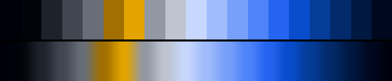

# P31 Cobalt Vigil

**Class** `mono_accent` — One hue family carries the whole frame; a single opposing accent appears in under a fifth of it. Restraint is the point.

**Scheme** blue 257-267 field; amber 70-78 accent

## Mood
A night watch by lamplight — one enormous blue room, and two small warm lights someone left burning at the far end.

## Look
Eleven stops of a single blue climb from ink to hoarfrost, a cool-grey descent closing the loop, and exactly two amber anchors carrying under a fifth of the chroma.

## Pattern pairing
Flow, plasma and interference fields — anything with one dominant current. The amber reads as a highlight, never as a second subject.

## Swatch

Top band: the 19 anchors. Bottom band: the cyclic ramp `gen_tables.py` expands from them.

## Class metrics

| metric | value | class target |
|---|---|---|
| `n` | 19 | · |
| `hue_bins` | 2 | 1 .. 3 |
| `hue_arc` | 179.849 | · |
| `accent_frac` | 0.169 | 0.04 .. 0.22 |
| `C_mean` | 0.28 | · |
| `C_lit` | 0.452 | 0.3 .. 0.75 |
| `C_sd` | 0.207 | · |
| `C_max` | 0.668 | · |
| `L_mean` | 0.489 | · |
| `L_sd` | 0.249 | · |
| `L_range` | 0.814 | 0.6 .. 1.0 |
| `dark_frac` | 0.263 | · |
| `light_frac` | 0.105 | · |
| `neutral_frac` | 0.316 | · |
| `max_step` | 19.2 | · |
| `step_ratio` | 1.74 | 0 .. 2.6 |

Gate: **PASS** — fit=1.00 nn=P26_thunderhead d=0.254

## Colors (19)

`00000a` `02040a` `1d222b` `414650` `686e78` `a17000` `e3a400` `9298a3` `bec4d0` `c7d7fd` `a0bcfc` `78a0fb` `4e83f9` `2564f0` `094ccc` `053c98` `032a6a` `011941` `00081f`
