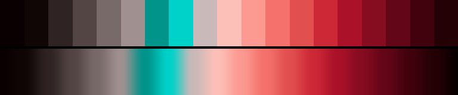

# P32 Oxblood Chapel

**Class** `mono_accent` — One hue family carries the whole frame; a single opposing accent appears in under a fifth of it. Restraint is the point.

**Scheme** red 17-33 field; verdigris 186-194 accent

## Mood
Deep red velvet in an unlit chapel, with one cold verdigris votive glass still catching light.

## Look
A crimson family from near-black to rose-white, returned by a warm-grey descent, with a single verdigris accent under a fifth of the chroma.

## Pattern pairing
Cellular, vein and drape patterns — the long red value ramp gives interior volume and the verdigris marks edges.

## Swatch

Top band: the 19 anchors. Bottom band: the cyclic ramp `gen_tables.py` expands from them.

## Class metrics

| metric | value | class target |
|---|---|---|
| `n` | 19 | · |
| `hue_bins` | 2 | 1 .. 3 |
| `hue_arc` | 170.58 | · |
| `accent_frac` | 0.148 | 0.04 .. 0.22 |
| `C_mean` | 0.276 | · |
| `C_lit` | 0.44 | 0.3 .. 0.75 |
| `C_sd` | 0.193 | · |
| `C_max` | 0.6 | · |
| `L_mean` | 0.496 | · |
| `L_sd` | 0.236 | · |
| `L_range` | 0.769 | 0.6 .. 1.0 |
| `dark_frac` | 0.263 | · |
| `light_frac` | 0.053 | · |
| `neutral_frac` | 0.316 | · |
| `max_step` | 18.17 | · |
| `step_ratio` | 1.76 | 0 .. 2.6 |

Gate: **PASS** — fit=1.00 nn=P24_obsidian_magma d=0.173

## Colors (19)

`0a0001` `100606` `2f2423` `524544` `786a69` `a09190` `00948a` `00d2c9` `c9b9b8` `fdc0b8` `fc9990` `f4726b` `e24f4f` `cc2836` `ab1229` `860c20` `630617` `42020d` `240105`
