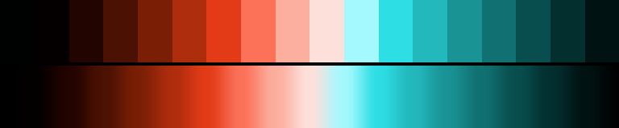

# P33 Tide & Coral

**Class** `duotone` — Exactly two hue poles, 110-180 deg apart, each with a full ramp. No third family. Reads as a two-ink print.

**Scheme** sea-teal 196-204 vs coral 26-34

## Mood
Two inks on wet paper: a cold sea-teal and a hot coral, with nothing between them but the paper.

## Look
Two full ramps roughly 170 degrees apart, meeting only at the dark floor and the light ceiling, so the loop closes at both ends.

## Pattern pairing
Two-body patterns — reaction-diffusion, duelling attractors, split fields. Anything that wants a clear "us and them".

## Swatch

Top band: the 18 anchors. Bottom band: the cyclic ramp `gen_tables.py` expands from them.

## Class metrics

| metric | value | class target |
|---|---|---|
| `n` | 18 | · |
| `hue_bins` | 2 | 2 .. 4 |
| `hue_arc` | 167.893 | 110 .. 250 |
| `accent_frac` | 0.396 | · |
| `C_mean` | 0.276 | · |
| `C_lit` | 0.349 | 0.35 .. 0.9 |
| `C_sd` | 0.164 | · |
| `C_max` | 0.634 | · |
| `L_mean` | 0.495 | · |
| `L_sd` | 0.28 | · |
| `L_range` | 0.869 | 0.6 .. 1.0 |
| `dark_frac` | 0.333 | · |
| `light_frac` | 0.222 | · |
| `neutral_frac` | 0.056 | · |
| `max_step` | 13.46 | · |
| `step_ratio` | 1.22 | 0 .. 2.6 |

Gate: **PASS** — fit=1.00 nn=P20_koi_pond_dusk d=0.176

## Colors (18)

`000101` `040000` `220400` `4b1102` `7a1f06` `ad2d0d` `e33b18` `fb7259` `fcae9f` `fee0db` `a3f9fe` `2ddee5` `23b8bc` `1a9395` `117071` `094e4e` `032f2f` `001312`
