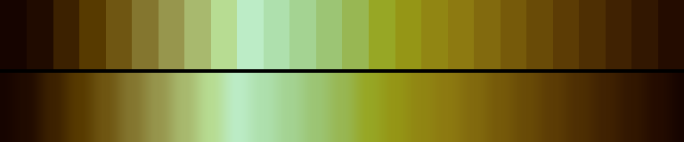

# P37 Ripening Field

**Class** `analogous` — Neighbouring hues only -- a continuous slice of the wheel, no more than a third of a turn. Warm and cool instances are separate palettes and the diversity gate keeps them apart.

**Scheme** wheat gold 45-65 -> chartreuse -> deep green

## Mood
A field two weeks before harvest — gold at the tips, chartreuse halfway down, still deep green at the root.

## Look
Gold through chartreuse into green, climbing to cream and returning down a dusty olive leg. The purely warm quarter-turn was not available: `house:ember` and `fantasy-24` already hold it and the same-class hue floor rejects anything within 36 degrees of them.

## Pattern pairing
Growth, plume and drift patterns; also slow radial washes, where a cool hue would read as a hole in the middle.

## Swatch

Top band: the 26 anchors. Bottom band: the cyclic ramp `gen_tables.py` expands from them.

## Class metrics

| metric | value | class target |
|---|---|---|
| `n` | 26 | · |
| `hue_bins` | 4 | 3 .. 5 |
| `hue_arc` | 85.114 | 50 .. 125 |
| `accent_frac` | 0.275 | 0.0 .. 0.32 |
| `C_mean` | 0.273 | · |
| `C_lit` | 0.312 | 0.3 .. 0.85 |
| `C_sd` | 0.085 | · |
| `C_max` | 0.447 | · |
| `L_mean` | 0.53 | · |
| `L_sd` | 0.228 | · |
| `L_range` | 0.758 | 0.6 .. 1.0 |
| `dark_frac` | 0.231 | · |
| `light_frac` | 0.154 | · |
| `neutral_frac` | 0.0 | · |
| `max_step` | 9.95 | · |
| `step_ratio` | 1.62 | 0 .. 2.4 |

Gate: **PASS** — fit=1.00 nn=house:gilded d=0.199

## Colors (26)

`160400` `200b00` `3c2100` `573a00` `6f5612` `84762f` `97964d` `a8b96e` `b7dc92` `bcecc6` `aee0ad` `a4d392` `9cc574` `98b753` `97a725` `959616` `918613` `8d7a11` `826a0e` `765a0a` `694b07` `5c3c05` `4e2f03` `402202` `321701` `240c00`
