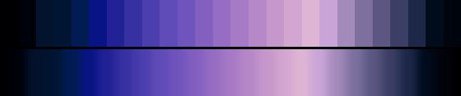

# P38 Nightbloom

**Class** `analogous` — Neighbouring hues only -- a continuous slice of the wheel, no more than a third of a turn. Warm and cool instances are separate palettes and the diversity gate keeps them apart.

**Scheme** azure 225-240 -> violet -> magenta

## Mood
Iris and hyacinth after dark — a cool slice of the wheel that never once gets warm.

## Look
Azure through violet into magenta, run darker and less chromatic than Fen Water so the two cool analogous palettes separate on tone as well as on hue.

## Pattern pairing
Swirl, vortex and drape patterns. Continuous hue means continuous motion — nothing here can produce a hard edge.

## Swatch

Top band: the 26 anchors. Bottom band: the cyclic ramp `gen_tables.py` expands from them.

## Class metrics

| metric | value | class target |
|---|---|---|
| `n` | 26 | · |
| `hue_bins` | 3 | 3 .. 5 |
| `hue_arc` | 65.449 | 50 .. 125 |
| `accent_frac` | 0.147 | 0.0 .. 0.32 |
| `C_mean` | 0.296 | · |
| `C_lit` | 0.334 | 0.3 .. 0.85 |
| `C_sd` | 0.149 | · |
| `C_max` | 0.545 | · |
| `L_mean` | 0.444 | · |
| `L_sd` | 0.232 | · |
| `L_range` | 0.782 | 0.6 .. 1.0 |
| `dark_frac` | 0.346 | · |
| `light_frac` | 0.038 | · |
| `neutral_frac` | 0.038 | · |
| `max_step` | 13.92 | · |
| `step_ratio` | 2.15 | 0 .. 2.4 |

Gate: **PASS** — fit=1.00 nn=P31_cobalt_vigil d=0.223

## Colors (26)

`000002` `00020a` `03122d` `001533` `011c52` `091484` `212295` `3630a3` `4b3eae` `604cb8` `7054bd` `8360c0` `956dc2` `a67ac5` `b788c8` `c597cb` `d3a6cf` `dfb5d5` `c8a5d7` `a28abb` `7d709f` `5b5782` `3b3f65` `1d2849` `000b1c` `00040b`
