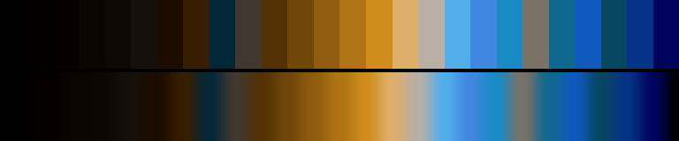

# P40 Harvest Storm

**Class** `split_complement` — A dominant hue against the two neighbours of its opposite (or a true triad). Tension without the mud of a straight complement.

**Scheme** harvest gold dominant; storm blue + violet accents

## Mood
Wheat under a bruised sky — gold light going flat as the storm front takes the horizon.

## Look
Gold dominant with storm blue and violet sitting either side of its opposite. Runs lighter and warmer-grounded than Cardinal & Jade so the two split-complements share no tone.

## Pattern pairing
Growth, branch and lattice patterns; the cool accents give branch tips and nodes somewhere to go that is not merely "brighter gold".

## Swatch

Top band: the 26 anchors. Bottom band: the cyclic ramp `gen_tables.py` expands from them.

## Class metrics

| metric | value | class target |
|---|---|---|
| `n` | 26 | · |
| `hue_bins` | 3 | 3 .. 6 |
| `hue_arc` | 195.93 | 170 .. 290 |
| `accent_frac` | 0.401 | 0.2 .. 0.6 |
| `C_mean` | 0.231 | · |
| `C_lit` | 0.37 | 0.4 .. 0.9 |
| `C_sd` | 0.162 | · |
| `C_max` | 0.528 | · |
| `L_mean` | 0.393 | · |
| `L_sd` | 0.226 | · |
| `L_range` | 0.78 | 0.65 .. 1.0 |
| `dark_frac` | 0.385 | · |
| `light_frac` | 0.0 | · |
| `neutral_frac` | 0.346 | · |
| `max_step` | 26.36 | · |
| `step_ratio` | 2.81 | 0 .. 2.8 |

Gate: **PASS** — fit=0.96 nn=P35_foundry_blue d=0.180

## Colors (26)

`000000` `030100` `060100` `0b0602` `0e0803` `17100a` `1d0c00` `371e02` `022838` `403830` `543105` `714609` `905c0f` `b07416` `d08d1c` `deae6b` `b9afa5` `52aeea` `4186e0` `198bc4` `7a7167` `106891` `0f59bf` `074762` `043387` `00045c`
