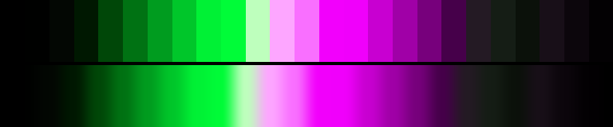

# P41 Acid Rail

**Class** `neon_on_black` — Half the ramp is near-black; what is lit is at maximum chroma. Electric, and the dark floor is what makes it read that way.

**Scheme** void floor; acid green + hot magenta at gamut edge

## Mood
A dark tunnel with two live rails in it: acid green one side, hot magenta the other. Nothing else is lit.

## Look
Ten near-black anchors form the floor; everything above it rides the gamut edge. The dark half is what makes the lit half read electric rather than merely bright.

## Pattern pairing
Line, spark and trail patterns on a dark ground — anything where the subject is thin and the background should vanish.

## Swatch

Top band: the 25 anchors. Bottom band: the cyclic ramp `gen_tables.py` expands from them.

## Class metrics

| metric | value | class target |
|---|---|---|
| `n` | 25 | · |
| `hue_bins` | 2 | 2 .. 5 |
| `hue_arc` | 178.092 | · |
| `accent_frac` | 0.434 | · |
| `C_mean` | 0.413 | · |
| `C_lit` | 0.689 | 0.6 .. 1.0 |
| `C_sd` | 0.327 | · |
| `C_max` | 0.958 | 0.8 .. 1.0 |
| `L_mean` | 0.435 | 0.18 .. 0.48 |
| `L_sd` | 0.289 | · |
| `L_range` | 0.94 | · |
| `dark_frac` | 0.44 | 0.4 .. 0.7 |
| `light_frac` | 0.16 | · |
| `neutral_frac` | 0.36 | · |
| `max_step` | 27.98 | · |
| `step_ratio` | 2.81 | 0 .. 3.0 |

Gate: **PASS** — fit=1.00 nn=P34_orchid_and_absinthe d=0.234

## Colors (25)

`000000` `000100` `030703` `001801` `004708` `007213` `009c1f` `00c62a` `00f135` `00fc38` `beffbd` `fda6ff` `f96fff` `f200fc` `f000fb` `c800d1` `a000a7` `77007c` `46004a` `241a24` `151d15` `0b110a` `180f18` `0c060c` `030103`
