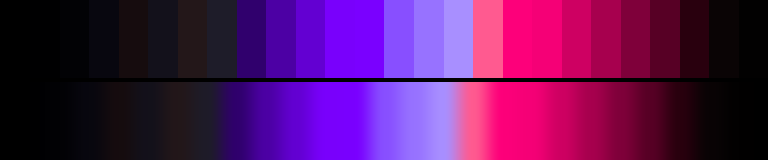

# P42 Blood Ultraviolet

**Class** `neon_on_black` — Half the ramp is near-black; what is lit is at maximum chroma. Electric, and the dark floor is what makes it read that way.

**Scheme** void floor; blood red + ultraviolet at gamut edge

## Mood
A blacklight room: everything is off except a red sign and the ultraviolet tube above it.

## Look
The same void floor as Acid Rail on the opposite side of the wheel — red and violet instead of green and magenta, so the two neon palettes cannot be mistaken for one another.

## Pattern pairing
Spark, filament and glow-decay patterns. Very strong under additive layering, where the black floor absorbs the accumulation.

## Swatch

Top band: the 26 anchors. Bottom band: the cyclic ramp `gen_tables.py` expands from them.

## Class metrics

| metric | value | class target |
|---|---|---|
| `n` | 26 | · |
| `hue_bins` | 2 | 2 .. 5 |
| `hue_arc` | 72.21 | · |
| `accent_frac` | 0.448 | · |
| `C_mean` | 0.4 | · |
| `C_lit` | 0.683 | 0.6 .. 1.0 |
| `C_sd` | 0.313 | · |
| `C_max` | 0.888 | 0.8 .. 1.0 |
| `L_mean` | 0.354 | 0.18 .. 0.48 |
| `L_sd` | 0.223 | · |
| `L_range` | 0.72 | · |
| `dark_frac` | 0.5 | 0.4 .. 0.7 |
| `light_frac` | 0.0 | · |
| `neutral_frac` | 0.385 | · |
| `max_step` | 21.68 | · |
| `step_ratio` | 2.91 | 0 .. 3.0 |

Gate: **PASS** — fit=1.00 nn=P14_ink-crimson d=0.278

## Colors (26)

`000000` `000001` `020205` `08070f` `160c0e` `13111b` `231719` `1e1c29` `30006d` `4c00a4` `6300d2` `7900fc` `7a00ff` `884fff` `9772ff` `a88fff` `ff5a90` `fd007a` `f50076` `ce0062` `a7004e` `7f003a` `570025` `29000e` `0a0405` `020101`
