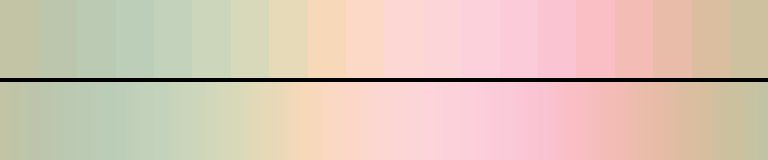

# P43 Sugared Almond

**Class** `pastel_wash` — High lightness, low chroma, tight value band. Nothing in it is dark. The soft end of the whole set.

**Scheme** warm pastels, blush through butter, all L 0.77-0.94

## Mood
Confectionery light — blush, apricot, butter and shell. Nothing in it is louder than a whisper and nothing in it is dark.

## Look
A tight warm value band with chroma held low. The loop closes because it never leaves the band, which is why this class needs no return leg.

## Pattern pairing
Soft bloom, blur and drift patterns. This is the opposite pole from the neon sets and exists so the scheduler has somewhere quiet to go.

## Swatch

Top band: the 20 anchors. Bottom band: the cyclic ramp `gen_tables.py` expands from them.

## Class metrics

| metric | value | class target |
|---|---|---|
| `n` | 20 | · |
| `hue_bins` | 6 | · |
| `hue_arc` | 134.09 | · |
| `accent_frac` | 0.484 | · |
| `C_mean` | 0.146 | 0.06 .. 0.3 |
| `C_lit` | 0.146 | · |
| `C_sd` | 0.03 | · |
| `C_max` | 0.203 | · |
| `L_mean` | 0.86 | 0.72 .. 0.92 |
| `L_sd` | 0.035 | 0.0 .. 0.14 |
| `L_range` | 0.099 | 0.1 .. 0.45 |
| `dark_frac` | 0.0 | 0.0 .. 0.08 |
| `light_frac` | 1.0 | · |
| `neutral_frac` | 0.0 | · |
| `max_step` | 2.54 | · |
| `step_ratio` | 1.45 | 0 .. 2.4 |

Gate: **PASS** — fit=1.00 nn=lospec:31 d=0.554

## Colors (20)

`c2c4a5` `bcc6ac` `bbcab3` `bdceb8` `c3d2bb` `ccd6bb` `d8d9ba` `e7dab8` `f7d9ba` `fcd8c7` `fcd7d3` `fcd5d9` `fcd1db` `fccbda` `fbc4d3` `f9bfc5` `f3bcb5` `e8bca8` `dbbea0` `cdc19f`
