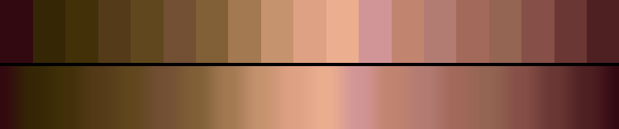

# P48 Kiln & Clay

**Class** `earth` — Ochre, clay, moss, bark, stone. Warm-biased mid hues at low chroma and mid lightness -- the only class that is deliberately muted rather than dark or pale.

**Scheme** terracotta -> ochre -> bark, all low chroma

## Mood
Unglazed pottery in a workshop — terracotta, slip, ash and bark. Muted rather than dark, which is the whole point of the class.

## Look
Warm mid hues at low chroma inside a mid lightness band. No anchor is either black or pale, so it never reads as a value ramp.

## Pattern pairing
Texture, grain, erosion and sediment patterns. Stays legible under heavy layering where a saturated palette goes muddy.

## Swatch

Top band: the 19 anchors. Bottom band: the cyclic ramp `gen_tables.py` expands from them.

## Class metrics

| metric | value | class target |
|---|---|---|
| `n` | 19 | · |
| `hue_bins` | 3 | · |
| `hue_arc` | 63.898 | 40 .. 160 |
| `accent_frac` | 0.131 | · |
| `C_mean` | 0.216 | · |
| `C_lit` | 0.223 | 0.12 .. 0.4 |
| `C_sd` | 0.026 | 0.0 .. 0.16 |
| `C_max` | 0.256 | · |
| `L_mean` | 0.517 | 0.38 .. 0.65 |
| `L_sd` | 0.17 | 0.12 .. 0.28 |
| `L_range` | 0.581 | · |
| `dark_frac` | 0.105 | · |
| `light_frac` | 0.0 | · |
| `neutral_frac` | 0.0 | · |
| `max_step` | 9.75 | · |
| `step_ratio` | 1.49 | 0 .. 2.4 |

Gate: **PASS** — fit=1.00 nn=house:ember d=0.189

## Colors (19)

`330911` `352605` `413008` `543a19` `60471e` `734f34` `815f37` `a37952` `c6936f` `dfa184` `ebae8e` `d29597` `c1846f` `b37c73` `a3695a` `936552` `864f47` `6a3734` `4e2022`
