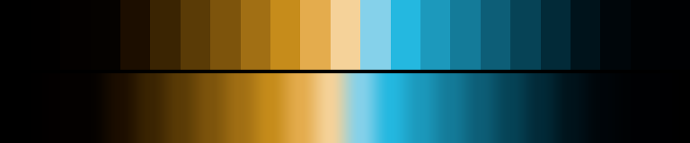

# P54 Sodium & Slate

**Class** `duotone` — Exactly two hue poles, 110-180 deg apart, each with a full ramp. No third family. Reads as a two-ink print.

**Scheme** sodium gold 71-79 vs slate blue 221-229

## Mood
A sodium lamp over a wet slate roof. Two temperatures, no third opinion, and a lot of night around them.

## Look
Both poles rise out of a shared near-black floor rather than meeting at a white ceiling, so the cyclic wrap happens in the dark where no cliff is visible. dark_frac 0.48 — this is the deep duotone.

## Pattern pairing
Two-body patterns: reaction-diffusion, duelling attractors, split fields. Anything that wants a clear "us and them".

## Swatch

Top band: the 23 anchors. Bottom band: the cyclic ramp `gen_tables.py` expands from them.

## Class metrics

| metric | value | class target |
|---|---|---|
| `n` | 23 | · |
| `hue_bins` | 2 | 2 .. 4 |
| `hue_arc` | 152.11 | 110 .. 250 |
| `accent_frac` | 0.47 | · |
| `C_mean` | 0.197 | · |
| `C_lit` | 0.303 | 0.35 .. 0.9 |
| `C_sd` | 0.126 | · |
| `C_max` | 0.409 | · |
| `L_mean` | 0.378 | · |
| `L_sd` | 0.277 | · |
| `L_range` | 0.88 | 0.6 .. 1.0 |
| `dark_frac` | 0.478 | · |
| `light_frac` | 0.087 | · |
| `neutral_frac` | 0.304 | · |
| `max_step` | 16.77 | · |
| `step_ratio` | 2.01 | 0 .. 2.6 |

Gate: **PASS** — fit=0.95 nn=P40_harvest_storm d=0.191

## Colors (23)

`000000` `010000` `040100` `050200` `1c0e00` `3a2402` `5a3b06` `7d540c` `a16f14` `c68c1b` `e4ac4d` `f5d299` `85d1ea` `24b8e0` `1c99bc` `147b99` `0d5e77` `064356` `022a38` `00131b` `00060a` `000204` `000103`
