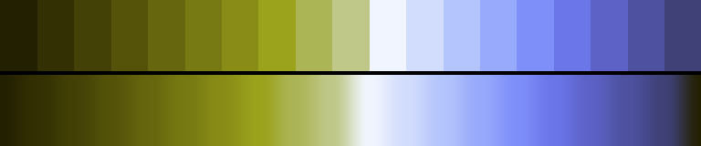

# P55 Riso Indigo

**Class** `duotone` — Exactly two hue poles, 110-180 deg apart, each with a full ramp. No third family. Reads as a two-ink print.

**Scheme** lime-olive 105-115 vs indigo 270-280, on a LIGHT ground

## Mood
A two-colour risograph run: lime and indigo laid over bright stock, with the paper showing through everywhere they miss.

## Look
The two inks share the value range unevenly — one owns the lower half, one the upper — and the whole palette is lifted off the floor: dark_frac 0.05, nothing in it is black. Against Sodium & Slate (dark_frac 0.48) the two duotones share a class and no tone at all.

## Pattern pairing
Lattice, scan and moire work; also the right choice when a dark palette has been up a while and the scheduler needs contrast.

## Swatch

Top band: the 19 anchors. Bottom band: the cyclic ramp `gen_tables.py` expands from them.

## Class metrics

| metric | value | class target |
|---|---|---|
| `n` | 19 | · |
| `hue_bins` | 2 | 2 .. 4 |
| `hue_arc` | 171.151 | 110 .. 250 |
| `accent_frac` | 0.492 | · |
| `C_mean` | 0.307 | · |
| `C_lit` | 0.341 | 0.35 .. 0.9 |
| `C_sd` | 0.124 | · |
| `C_max` | 0.519 | · |
| `L_mean` | 0.601 | · |
| `L_sd` | 0.2 | · |
| `L_range` | 0.731 | 0.6 .. 1.0 |
| `dark_frac` | 0.053 | · |
| `light_frac` | 0.21 | · |
| `neutral_frac` | 0.053 | · |
| `max_step` | 21.28 | · |
| `step_ratio` | 2.5 | 0 .. 2.6 |

Gate: **PASS** — fit=0.99 nn=house:jewels d=0.176

## Colors (19)

`232001` `333003` `434106` `545309` `66660e` `777912` `898d17` `9ba21c` `acb556` `bfc889` `f1f5ff` `d2ddfd` `b4c4fc` `98aafb` `7f8ffa` `6b76e9` `5c62c6` `4d519f` `3f4177`
