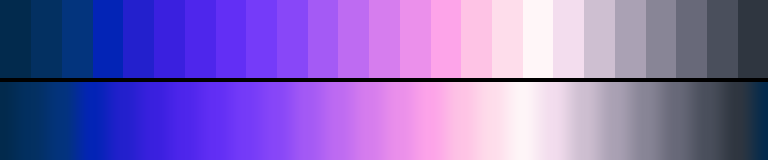

# P56 Iris Morning

**Class** `analogous` — Neighbouring hues only -- a continuous slice of the wheel, no more than a third of a turn. Warm and cool instances are separate palettes and the diversity gate keeps them apart.

**Scheme** blue-violet 250 -> violet -> rose 360, a slow third of a turn

## Mood
Iris and hyacinth in early light — violet through to rose-white, with only the deepest anchor still holding any night.

## Look
A high-key analogous: L_mean 0.60, dark_frac 0.04, climbing to a rose-white ceiling and returning down a greyed leg. The chromatic peak sits low in the value range, so the palette reads as light without going pastel.

## Pattern pairing
Swirl, vortex and drape patterns. Continuous hue means continuous motion — nothing here can produce a hard edge.

## Swatch

Top band: the 25 anchors. Bottom band: the cyclic ramp `gen_tables.py` expands from them.

## Class metrics

| metric | value | class target |
|---|---|---|
| `n` | 25 | · |
| `hue_bins` | 4 | 3 .. 5 |
| `hue_arc` | 75.737 | 50 .. 125 |
| `accent_frac` | 0.231 | 0.0 .. 0.32 |
| `C_mean` | 0.399 | · |
| `C_lit` | 0.513 | 0.3 .. 0.85 |
| `C_sd` | 0.288 | · |
| `C_max` | 0.804 | · |
| `L_mean` | 0.604 | · |
| `L_sd` | 0.209 | · |
| `L_range` | 0.7 | 0.6 .. 1.0 |
| `dark_frac` | 0.04 | · |
| `light_frac` | 0.24 | · |
| `neutral_frac` | 0.2 | · |
| `max_step` | 10.01 | · |
| `step_ratio` | 1.49 | 0 .. 2.4 |

Gate: **PASS** — fit=1.00 nn=P06_fireball-32 d=0.251

## Colors (25)

`022a4d` `033061` `03347d` `0324b6` `2320cd` `3a20df` `4e26ec` `622ff5` `753bf9` `8847f8` `a45af5` `be6bf2` `d67dee` `eb90eb` `fda4e9` `fec3e5` `feddeb` `fff6f8` `f3ddee` `cebfd1` `aaa1b4` `888596` `686979` `4a4f5c` `2f3640`
