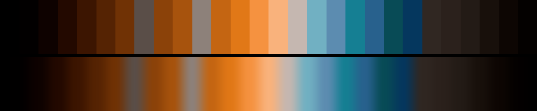

# P59 Flare Path

**Class** `split_complement` — A dominant hue against the two neighbours of its opposite (or a true triad). Tension without the mud of a straight complement.

**Scheme** flare amber 42-58 dominant; cold blue + indigo accents

## Mood
Runway flares seen from the far end of a wet field, with the last of the cold blue still in the sky behind them.

## Look
Amber dominant against the two neighbours of its opposite, on the deepest floor of the three (six extra near-black anchors, dark_frac 0.39) and the highest chroma scale.

## Pattern pairing
Plume, heat and drift patterns; the cold accents give the edges somewhere to go that is not merely "less orange".

## Swatch

Top band: the 28 anchors. Bottom band: the cyclic ramp `gen_tables.py` expands from them.

## Class metrics

| metric | value | class target |
|---|---|---|
| `n` | 28 | · |
| `hue_bins` | 3 | 3 .. 6 |
| `hue_arc` | 198.814 | 170 .. 290 |
| `accent_frac` | 0.292 | 0.2 .. 0.6 |
| `C_mean` | 0.197 | · |
| `C_lit` | 0.332 | 0.4 .. 0.9 |
| `C_sd` | 0.145 | · |
| `C_max` | 0.488 | · |
| `L_mean` | 0.402 | · |
| `L_sd` | 0.235 | · |
| `L_range` | 0.819 | 0.65 .. 1.0 |
| `dark_frac` | 0.393 | · |
| `light_frac` | 0.036 | · |
| `neutral_frac` | 0.393 | · |
| `max_step` | 13.71 | · |
| `step_ratio` | 1.72 | 0 .. 2.8 |

Gate: **PASS** — fit=0.92 nn=lospec:fantasy-24 d=0.203

## Colors (28)

`000000` `020000` `0e0200` `230900` `3c1501` `552303` `703205` `5a4e48` `8b4209` `a7530d` `8d817a` `c46512` `e17817` `f59240` `f9b27c` `c5b7b0` `71b0c2` `5c8cb0` `157f93` `28618d` `084b56` `05375e` `302722` `2b211c` `231b16` `18100b` `0d0603` `040100`
