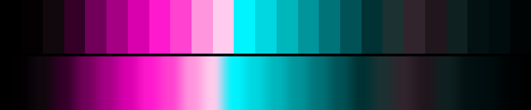

# P61 Neon Alley

**Class** `neon_on_black` — Half the ramp is near-black; what is lit is at maximum chroma. Electric, and the dark floor is what makes it read that way.

**Scheme** void floor; hot rose 340 + ion cyan 200 at the gamut edge

## Mood
Wet asphalt at night: a hot pink sign above, its cyan reflection below, and absolutely nothing lit between them.

## Look
Ten near-black anchors form the floor; everything above rides the gamut edge, with the rose pole at the highest chroma sRGB has (C_max 0.98). The dark half is what makes the lit half read electric rather than merely bright.

## Pattern pairing
Line, spark and trail patterns on a dark ground — anything where the subject is thin and the background should vanish.

## Swatch

Top band: the 25 anchors. Bottom band: the cyclic ramp `gen_tables.py` expands from them.

## Class metrics

| metric | value | class target |
|---|---|---|
| `n` | 25 | · |
| `hue_bins` | 2 | 2 .. 5 |
| `hue_arc` | 140.367 | · |
| `accent_frac` | 0.33 | · |
| `C_mean` | 0.291 | · |
| `C_lit` | 0.481 | 0.6 .. 1.0 |
| `C_sd` | 0.257 | · |
| `C_max` | 0.87 | 0.8 .. 1.0 |
| `L_mean` | 0.424 | 0.18 .. 0.48 |
| `L_sd` | 0.27 | · |
| `L_range` | 0.899 | · |
| `dark_frac` | 0.48 | 0.4 .. 0.7 |
| `light_frac` | 0.12 | · |
| `neutral_frac` | 0.36 | · |
| `max_step` | 20.99 | · |
| `step_ratio` | 2.29 | 0 .. 3.0 |

Gate: **PASS** — fit=0.87 nn=P81_ion_trail d=0.177

## Colors (25)

`000000` `040103` `10080d` `340028` `700059` `a50084` `d900ae` `ff19ce` `ff42d0` `ff95dd` `ffcced` `00f4fe` `00d7e0` `00b6bd` `00959b` `007378` `005256` `003133` `1c3132` `31242d` `20161c` `0f2021` `041112` `000c0d` `000405`
