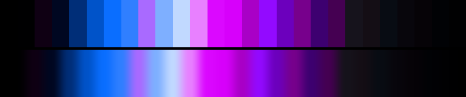

# P62 Violet Reactor

**Class** `neon_on_black` — Half the ramp is near-black; what is lit is at maximum chroma. Electric, and the dark floor is what makes it read that way.

**Scheme** void floor; electric blue 260 + magenta 320, violet 300 filament

## Mood
Something running hot behind leaded glass: a blue core, a magenta shell, and one violet filament threading between them.

## Look
THREE lit hues over the void instead of two — the class allows up to five hue bins, and the third filament is what separates this from a two-rail neon. Nine floor anchors at a fine lightness step keep dark_frac inside the band; a coarse step walks the floor up past L 0.30 and the class fails (measured: dark_frac 0.28).

## Pattern pairing
Filament, glow-decay and particle patterns. Very strong under additive layering, where the black floor absorbs the accumulation instead of blowing out.

## Swatch

Top band: the 27 anchors. Bottom band: the cyclic ramp `gen_tables.py` expands from them.

## Class metrics

| metric | value | class target |
|---|---|---|
| `n` | 27 | · |
| `hue_bins` | 3 | 2 .. 5 |
| `hue_arc` | 60.239 | · |
| `accent_frac` | 0.299 | · |
| `C_mean` | 0.394 | · |
| `C_lit` | 0.661 | 0.6 .. 1.0 |
| `C_sd` | 0.315 | · |
| `C_max` | 0.938 | 0.8 .. 1.0 |
| `L_mean` | 0.374 | 0.18 .. 0.48 |
| `L_sd` | 0.256 | · |
| `L_range` | 0.88 | · |
| `dark_frac` | 0.444 | 0.4 .. 0.7 |
| `light_frac` | 0.037 | · |
| `neutral_frac` | 0.333 | · |
| `max_step` | 21.66 | · |
| `step_ratio` | 2.29 | 0 .. 3.0 |

Gate: **PASS** — fit=1.00 nn=P42_blood_ultraviolet d=0.175

## Colors (27)

`000000` `000001` `0f0013` `000721` `002e78` `0053c9` `0a6eff` `307fff` `a96aff` `7eafff` `c1d9ff` `e880ff` `db08ff` `d700fb` `a900c6` `930aff` `6c00bd` `77008c` `3d0070` `450052` `16131c` `140e15` `080c13` `08060c` `060307` `010205` `010102`
