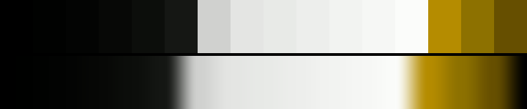

# P66 Gold Rule

**Class** `stark` — Two or three values, almost no midtones, chroma near zero or slammed. Graphic and hard -- the opposite pole from pastel. The only class permitted a high step_ratio: the cliff IS the look.

**Scheme** black / white / one gold rule

## Mood
Black ink, white stock, and a single gold rule ruled across it.

## Look
Two value plateaus with almost nothing between them plus three gold anchors. The cliff IS the look — stark is the one class the smoothness budget is relaxed for, and this palette uses nearly all of it (step_ratio 5.2 against a budget of 5.0 + 1.5 tolerance).

## Pattern pairing
Hard-edged geometry: grids, bars, halftone, scanline. Soft-edged patterns should stay away from this one.

## Swatch

Top band: the 16 anchors. Bottom band: the cyclic ramp `gen_tables.py` expands from them.

## Class metrics

| metric | value | class target |
|---|---|---|
| `n` | 16 | · |
| `hue_bins` | 2 | 1 .. 3 |
| `hue_arc` | 3.759 | · |
| `accent_frac` | 0.0 | · |
| `C_mean` | 0.075 | 0.0 .. 0.3 |
| `C_lit` | 0.343 | · |
| `C_sd` | 0.131 | · |
| `C_max` | 0.409 | · |
| `L_mean` | 0.558 | · |
| `L_sd` | 0.377 | 0.28 .. 0.5 |
| `L_range` | 0.99 | 0.85 .. 1.0 |
| `dark_frac` | 0.375 | · |
| `light_frac` | 0.438 | · |
| `neutral_frac` | 0.812 | 0.35 .. 1.0 |
| `max_step` | 65.81 | · |
| `step_ratio` | 5.21 | 0 .. 5.0 |

Gate: **PASS** — fit=0.98 nn=P87_hazard_tape d=0.257

## Colors (16)

`000000` `010201` `030403` `070806` `0c0e0b` `151714` `d0d1cf` `e4e5e3` `e8eae7` `edeeec` `f2f3f1` `f6f7f5` `fbfcfa` `b58c00` `8d7100` `664f00`
