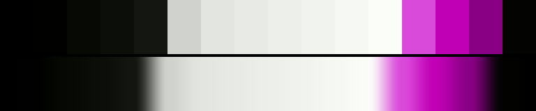

# P67 Magenta Press

**Class** `stark` — Two or three values, almost no midtones, chroma near zero or slammed. Graphic and hard -- the opposite pole from pastel. The only class permitted a high step_ratio: the cliff IS the look.

**Scheme** near-black / paper white / magenta slash

## Mood
A press run with the magenta plate landing where nothing asked it to. Black, paper, and one violent stripe.

## Look
The same two-plateau structure as Gold Rule with the accent on the far side of the wheel and at twice the chroma (C_lit 0.70 against 0.34) — the loudest palette in the block, and by construction the least smooth.

## Pattern pairing
Bar, tile and halftone patterns; reads as press artefact rather than poster art.

## Swatch

Top band: the 16 anchors. Bottom band: the cyclic ramp `gen_tables.py` expands from them.

## Class metrics

| metric | value | class target |
|---|---|---|
| `n` | 16 | · |
| `hue_bins` | 2 | 1 .. 3 |
| `hue_arc` | 3.943 | · |
| `accent_frac` | 0.0 | · |
| `C_mean` | 0.153 | 0.0 .. 0.3 |
| `C_lit` | 0.699 | · |
| `C_sd` | 0.264 | · |
| `C_max` | 0.766 | · |
| `L_mean` | 0.557 | · |
| `L_sd` | 0.378 | 0.28 .. 0.5 |
| `L_range` | 0.99 | 0.85 .. 1.0 |
| `dark_frac` | 0.375 | · |
| `light_frac` | 0.438 | · |
| `neutral_frac` | 0.812 | 0.35 .. 1.0 |
| `max_step` | 66.09 | · |
| `step_ratio` | 4.94 | 0 .. 5.0 |

Gate: **PASS** — fit=1.00 nn=P88_ultraviolet_press d=0.167

## Colors (16)

`000000` `010200` `060904` `0b0e09` `141711` `cfd2cd` `e3e5e1` `e8eae5` `ecefea` `f1f3ef` `f6f8f3` `fafdf8` `da4ada` `c000b4` `890085` `030402`
