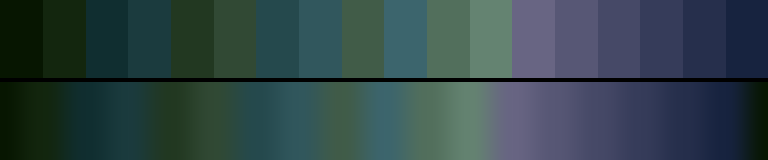

# P69 Lichen & Slate

**Class** `earth` — Ochre, clay, moss, bark, stone. Warm-biased mid hues at low chroma and mid lightness -- the only class that is deliberately muted rather than dark or pale.

**Scheme** lichen green 135 and slate violet 265, two muted lobes

## Mood
A north wall in wet woodland: lichen on the stone, slate underneath, and not a warm colour anywhere.

## Look
TWO muted hue lobes instead of one continuous band. That shape is what got a third earth into the library at all — the four earths already shipped occupy the single-lobe hue profiles, and every single-lobe candidate collided with one of them on the same-class floor. The darkest earth of the three (L_mean 0.38).

## Pattern pairing
Crack, grain and erosion patterns; cross-fades well with the warm earths from the other blocks.

## Swatch

Top band: the 18 anchors. Bottom band: the cyclic ramp `gen_tables.py` expands from them.

## Class metrics

| metric | value | class target |
|---|---|---|
| `n` | 18 | · |
| `hue_bins` | 6 | · |
| `hue_arc` | 148.915 | 40 .. 160 |
| `accent_frac` | 0.593 | · |
| `C_mean` | 0.142 | · |
| `C_lit` | 0.142 | 0.12 .. 0.4 |
| `C_sd` | 0.015 | 0.0 .. 0.16 |
| `C_max` | 0.168 | · |
| `L_mean` | 0.383 | 0.38 .. 0.65 |
| `L_sd` | 0.105 | 0.12 .. 0.28 |
| `L_range` | 0.401 | · |
| `dark_frac` | 0.222 | · |
| `light_frac` | 0.0 | · |
| `neutral_frac` | 0.0 | · |
| `max_step` | 12.49 | · |
| `step_ratio` | 2.06 | 0 .. 2.4 |

Gate: **PASS** — fit=0.96 nn=lospec:steam-lords d=0.233

## Colors (18)

`071601` `13260e` `102e30` `1b3b3e` `223821` `314934` `25494d` `31575d` `415c48` `3c656d` `526f5c` `648371` `686583` `575775` `464967` `363c5a` `262f4c` `17233f`
