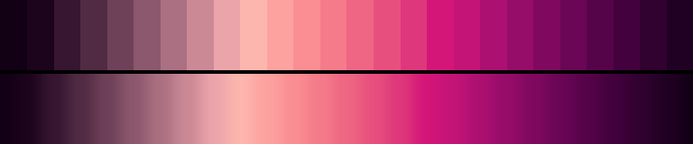

# P76 Claret Run

**Class** `analogous` — Neighbouring hues only -- a continuous slice of the wheel, no more than a third of a turn. Warm and cool instances are separate palettes and the diversity gate keeps them apart.

**Scheme** orchid 312-328 -> claret -> ember, roughly a fifth of a turn

## Mood
The last of the light through a bottle — orchid at the neck, claret through the body, ember where it touches the table.

## Look
A short continuous slice of the wheel that starts violet and ends warm, climbing to a pale rose and returning down a dusty brick leg. The purely warm quarter-turn was not available: house:ember and fantasy-24 already hold it and the same-class hue floor rejects anything within 36 degrees of them.

## Pattern pairing
Plume, drift and drape patterns; also slow radial washes, where a cool hue would read as a hole punched in the middle.

## Swatch

Top band: the 26 anchors. Bottom band: the cyclic ramp `gen_tables.py` expands from them.

## Class metrics

| metric | value | class target |
|---|---|---|
| `n` | 26 | · |
| `hue_bins` | 3 | 3 .. 5 |
| `hue_arc` | 50.612 | 50 .. 125 |
| `accent_frac` | 0.026 | 0.0 .. 0.32 |
| `C_mean` | 0.379 | · |
| `C_lit` | 0.432 | 0.3 .. 0.85 |
| `C_sd` | 0.162 | · |
| `C_max` | 0.679 | · |
| `L_mean` | 0.494 | · |
| `L_sd` | 0.213 | · |
| `L_range` | 0.71 | 0.6 .. 1.0 |
| `dark_frac` | 0.231 | · |
| `light_frac` | 0.077 | · |
| `neutral_frac` | 0.0 | · |
| `max_step` | 9.04 | · |
| `step_ratio` | 1.55 | 0 .. 2.4 |

Gate: **PASS** — fit=1.00 nn=P72_damson_hour d=0.176

## Colors (26)

`120015` `1c041c` `361630` `512b44` `6e4158` `8c586d` `ab7082` `cb8996` `eca4ab` `fdb6ae` `fda29f` `fa8e93` `f57b8a` `ee6683` `e7507e` `df377b` `d41679` `c41478` `ac1071` `960c69` `80095f` `6a0655` `56044a` `43023d` `310130` `210123`
