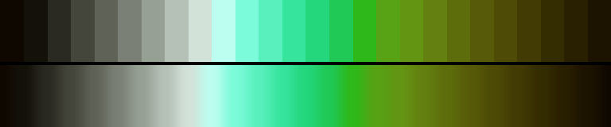

# P77 Reed Bed

**Class** `analogous` — Neighbouring hues only -- a continuous slice of the wheel, no more than a third of a turn. Warm and cool instances are separate palettes and the diversity gate keeps them apart.

**Scheme** chartreuse 72-88 -> green -> teal, roughly a third of a turn

## Mood
Late sun through a reed bed — chartreuse at the tips, green down the stems, and teal in the water underneath.

## Look
The jade->teal->azure slice this palette started as could not be shipped: at every chroma the builder can reach, that arc scores 1.00 as `earth` and only 0.97 as `analogous`, because teal and azure sit low in the sRGB gamut (max C_norm 0.47 and 0.42) and a muted mid-lightness cool ramp IS an earth palette by definition. This site clears it: chartreuse and green reach C_norm 0.53-0.75, so a high-chroma climb over a near-neutral return leg pushes C_sd past what `earth` allows.

## Pattern pairing
Ripple, caustic and cellular-noise patterns. With hue held to a narrow slice, brightness does all the storytelling.

## Swatch

Top band: the 26 anchors. Bottom band: the cyclic ramp `gen_tables.py` expands from them.

## Class metrics

| metric | value | class target |
|---|---|---|
| `n` | 26 | · |
| `hue_bins` | 3 | 3 .. 5 |
| `hue_arc` | 75.517 | 50 .. 125 |
| `accent_frac` | 0.232 | 0.0 .. 0.32 |
| `C_mean` | 0.264 | · |
| `C_lit` | 0.439 | 0.3 .. 0.85 |
| `C_sd` | 0.203 | · |
| `C_max` | 0.661 | · |
| `L_mean` | 0.555 | · |
| `L_sd` | 0.243 | · |
| `L_range` | 0.808 | 0.6 .. 1.0 |
| `dark_frac` | 0.231 | · |
| `light_frac` | 0.192 | · |
| `neutral_frac` | 0.308 | · |
| `max_step` | 10.43 | · |
| `step_ratio` | 1.54 | 0 .. 2.4 |

Gate: **PASS** — fit=1.00 nn=P71_jade_lantern d=0.170

## Colors (26)

`0f0800` `14110b` `2b2a22` `44453b` `5f6257` `7a8075` `97a095` `b5c0b6` `d3e2d9` `bcfef0` `7bfbd9` `59f0bd` `37e49e` `24d67c` `20c855` `2fb819` `57a215` `639513` `638010` `5e6d0c` `575b09` `4d4b06` `423b04` `352d02` `291f01` `1c1300`
