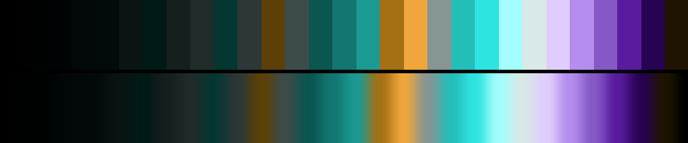

# P78 Lagoon Triad

**Class** `split_complement` — A dominant hue against the two neighbours of its opposite (or a true triad). Tension without the mud of a straight complement.

**Scheme** lagoon cyan dominant; fuchsia + gold accents

## Mood
Shallow water over pale sand with something pink living in it. The lagoon owns the frame and the two warm notes are what is in it.

## Look
A long cyan ramp against fuchsia and gold — a true triad rather than a strict split, which is what the one remaining free site in this class turned out to be. The mirror of P39 Cardinal & Jade: there a warm dominant with cool accents, here the reverse.

## Pattern pairing
Tunnel, shear and ribbon patterns; the dominant field carries the motion and the two warm accents mark leading edges.

## Swatch

Top band: the 29 anchors. Bottom band: the cyclic ramp `gen_tables.py` expands from them.

## Class metrics

| metric | value | class target |
|---|---|---|
| `n` | 29 | · |
| `hue_bins` | 4 | 3 .. 6 |
| `hue_arc` | 229.67 | 170 .. 290 |
| `accent_frac` | 0.605 | 0.2 .. 0.6 |
| `C_mean` | 0.203 | · |
| `C_lit` | 0.351 | 0.4 .. 0.9 |
| `C_sd` | 0.166 | · |
| `C_max` | 0.578 | · |
| `L_mean` | 0.439 | · |
| `L_sd` | 0.275 | · |
| `L_range` | 0.94 | 0.65 .. 1.0 |
| `dark_frac` | 0.379 | · |
| `light_frac` | 0.138 | · |
| `neutral_frac` | 0.414 | · |
| `max_step` | 20.43 | · |
| `step_ratio` | 2.0 | 0 .. 2.8 |

Gate: **PASS** — fit=0.94 nn=P75_fuchsia_and_verdigris d=0.204

## Colors (29)

`000000` `000202` `000303` `020908` `020b0a` `091413` `011a17` `141f1e` `202c2a` `043731` `2c3837` `5d4007` `3d4b49` `0a5650` `137771` `1b9a94` `a57014` `f0a63c` `869694` `24beb9` `2ee4e1` `a3fefd` `d8e9e7` `e1cdfd` `b58dee` `8558c6` `581b9e` `280352` `1f1401`
