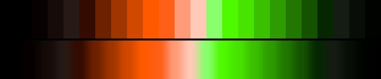

# P79 Marsh Light

**Class** `neon_on_black` — Half the ramp is near-black; what is lit is at maximum chroma. Electric, and the dark floor is what makes it read that way.

**Scheme** void floor; acid green 136-146 + ember orange 40-52 at the gamut edge

## Mood
Will-o'-the-wisp over black water: a cold green light and a warm one, both a long way off, and nothing lit between here and them.

## Look
This started as a two-green neon and could not be shipped that way: a single hue family climbing out of black over a steep value ramp scores 1.00 as `metallic` — that is the literal definition of the class — and only 0.95 as `neon_on_black`. Opening the pair to 96 degrees of hue arc kills the metallic reading outright while keeping both lit ramps on the gamut edge.

## Pattern pairing
Line, spark and trail patterns on a dark ground — anything where the subject is thin and the background should vanish.

## Swatch

Top band: the 24 anchors. Bottom band: the cyclic ramp `gen_tables.py` expands from them.

## Class metrics

| metric | value | class target |
|---|---|---|
| `n` | 24 | · |
| `hue_bins` | 2 | 2 .. 5 |
| `hue_arc` | 100.138 | · |
| `accent_frac` | 0.425 | · |
| `C_mean` | 0.354 | · |
| `C_lit` | 0.546 | 0.6 .. 1.0 |
| `C_sd` | 0.267 | · |
| `C_max` | 0.84 | 0.8 .. 1.0 |
| `L_mean` | 0.445 | 0.18 .. 0.48 |
| `L_sd` | 0.29 | · |
| `L_range` | 0.9 | · |
| `dark_frac` | 0.417 | 0.4 .. 0.7 |
| `light_frac` | 0.167 | · |
| `neutral_frac` | 0.333 | · |
| `max_step` | 23.45 | · |
| `step_ratio` | 2.5 | 0 .. 3.0 |

Gate: **PASS** — fit=0.94 nn=P71_jade_lantern d=0.212

## Colors (24)

`000000` `010000` `070201` `160b08` `271915` `340b00` `6d2100` `9f3500` `d14800` `fe5900` `ff5f16` `ff9b78` `ffcab7` `89ff6d` `4ff900` `48e400` `3bc000` `2e9c00` `217700` `145200` `052700` `151c13` `080d07` `010301`
