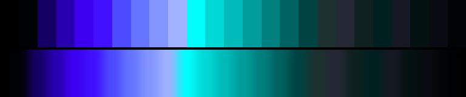

# P81 Ion Trail

**Class** `neon_on_black` — Half the ramp is near-black; what is lit is at maximum chroma. Electric, and the dark floor is what makes it read that way.

**Scheme** void floor; violet 274-282 + ion cyan 194-204 at the gamut edge

## Mood
A long-exposure of something moving fast in the dark — violet at the head of the trail, cyan where it has already cooled.

## Look
The coldest of the three neons: both lit hues are on the blue half of the wheel, which no other neon in the library is. The violet carries the chroma and the cyan carries the reach.

## Pattern pairing
Trail, comet and motion-blur patterns; also anything additive, where two cool hues stack into white instead of into mud.

## Swatch

Top band: the 25 anchors. Bottom band: the cyclic ramp `gen_tables.py` expands from them.

## Class metrics

| metric | value | class target |
|---|---|---|
| `n` | 25 | · |
| `hue_bins` | 2 | 2 .. 5 |
| `hue_arc` | 80.467 | · |
| `accent_frac` | 0.325 | · |
| `C_mean` | 0.32 | · |
| `C_lit` | 0.519 | 0.6 .. 1.0 |
| `C_sd` | 0.272 | · |
| `C_max` | 0.899 | 0.8 .. 1.0 |
| `L_mean` | 0.412 | 0.18 .. 0.48 |
| `L_sd` | 0.246 | · |
| `L_range` | 0.9 | · |
| `dark_frac` | 0.44 | 0.4 .. 0.7 |
| `light_frac` | 0.08 | · |
| `neutral_frac` | 0.32 | · |
| `max_step` | 21.06 | · |
| `step_ratio` | 2.45 | 0 .. 3.0 |

Gate: **PASS** — fit=0.91 nn=P50_carnival_at_midnight d=0.225

## Colors (25)

`000000` `010205` `140065` `2900af` `3c00f0` `4111ff` `4c4bff` `6575ff` `8295ff` `a1b2ff` `00fdfc` `00d9d7` `00bbba` `009d9c` `00807f` `006261` `004343` `1c3130` `252835` `0f2020` `002020` `161923` `041111` `090b12` `000404`
