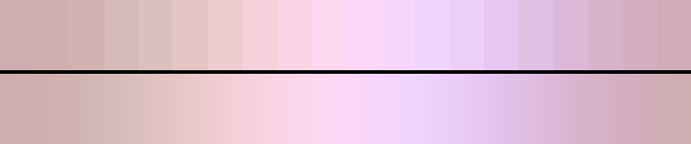

# P82 Lilac Powder

**Class** `pastel_wash` — High lightness, low chroma, tight value band. Nothing in it is dark. The soft end of the whole set.

**Scheme** lilac and orchid pastels, all L 0.76-0.93

## Mood
Powdered sugar over something purple. Lilac, orchid and the palest mauve, none of it louder than a whisper.

## Look
A tight high value band with chroma held low, walking out and back across the orchid slice. The loop closes because it never leaves the band — which is why this class needs no return leg, and could not afford one anyway without breaking the L_sd budget.

## Pattern pairing
Bloom, blur and slow-drift patterns. This is where the scheduler goes when the composition needs to get quiet.

## Swatch

Top band: the 20 anchors. Bottom band: the cyclic ramp `gen_tables.py` expands from them.

## Class metrics

| metric | value | class target |
|---|---|---|
| `n` | 20 | · |
| `hue_bins` | 3 | · |
| `hue_arc` | 65.015 | · |
| `accent_frac` | 0.172 | · |
| `C_mean` | 0.149 | 0.06 .. 0.3 |
| `C_lit` | 0.149 | · |
| `C_sd` | 0.036 | · |
| `C_max` | 0.204 | · |
| `L_mean` | 0.85 | 0.72 .. 0.92 |
| `L_sd` | 0.049 | 0.0 .. 0.14 |
| `L_range` | 0.139 | 0.1 .. 0.45 |
| `dark_frac` | 0.0 | 0.0 .. 0.08 |
| `light_frac` | 0.75 | · |
| `neutral_frac` | 0.0 | · |
| `max_step` | 2.29 | · |
| `step_ratio` | 1.38 | 0 .. 2.4 |

Gate: **PASS** — fit=1.00 nn=P09_vaporsthetic d=0.395

## Colors (20)

`cfaeb1` `cfb0b0` `d1b4b2` `d5bab7` `dcc0bd` `e5c6c5` `eecbcf` `f6d0da` `fbd4e5` `fcd7ef` `fcd7f8` `f7d6fc` `f1d4fc` `eccefa` `e6c7f2` `e1c0e6` `ddb9d9` `d9b3cc` `d5afc0` `d2adb7`
