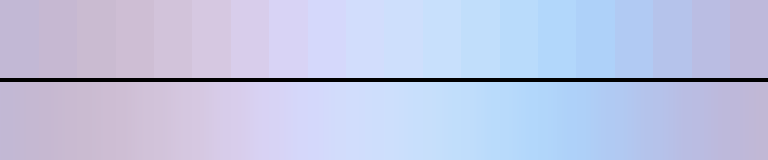

# P84 Periwinkle Hour

**Class** `pastel_wash` — High lightness, low chroma, tight value band. Nothing in it is dark. The soft end of the whole set.

**Scheme** periwinkle and cornflower pastels, all L 0.76-0.93

## Mood
Six in the morning through a net curtain — periwinkle, cornflower and the faintest grey-blue.

## Look
The coolest of the pastels and the only one on the blue side of the wheel that is not mint. Runs marginally darker than Buttermilk Field so the three new pastels separate on tone as well as hue.

## Pattern pairing
Bloom, haze and slow-wave patterns; pairs especially well cross-fading into the neon sets, since it is their exact opposite in every metric the taxonomy measures.

## Swatch

Top band: the 20 anchors. Bottom band: the cyclic ramp `gen_tables.py` expands from them.

## Class metrics

| metric | value | class target |
|---|---|---|
| `n` | 20 | · |
| `hue_bins` | 3 | · |
| `hue_arc` | 67.193 | · |
| `accent_frac` | 0.19 | · |
| `C_mean` | 0.145 | 0.06 .. 0.3 |
| `C_lit` | 0.145 | · |
| `C_sd` | 0.03 | · |
| `C_max` | 0.204 | · |
| `L_mean` | 0.85 | 0.72 .. 0.92 |
| `L_sd` | 0.035 | 0.0 .. 0.14 |
| `L_range` | 0.1 | 0.1 .. 0.45 |
| `dark_frac` | 0.0 | 0.0 .. 0.08 |
| `light_frac` | 1.0 | · |
| `neutral_frac` | 0.0 | · |
| `max_step` | 1.85 | · |
| `step_ratio` | 1.4 | 0 .. 2.4 |

Gate: **PASS** — fit=1.00 nn=P44_sea_glass_morning d=0.322

## Colors (20)

`c2b8d5` `c6b8d2` `cabbd1` `cebed4` `d2c3da` `d6c8e1` `d8cdeb` `d8d3f5` `d5d8fb` `d2ddfc` `cedffc` `c8e0fc` `c1defb` `b9dbfb` `b2d7fb` `aed1f9` `b1caf3` `b5c3eb` `babde3` `beb9db`
