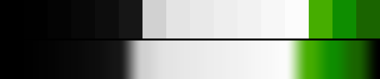

# P87 Hazard Tape

**Class** `stark` — Two or three values, almost no midtones, chroma near zero or slammed. Graphic and hard -- the opposite pole from pastel. The only class permitted a high step_ratio: the cliff IS the look.

**Scheme** black / white / hazard lime

## Mood
Black, white, and one lime slash across both. Signage, not painting.

## Look
Two value plateaus with almost nothing between them plus three lime anchors. The cliff IS the look — stark is the one class whose smoothness budget is deliberately relaxed, to step_ratio 5.

## Pattern pairing
Hard-edged geometry: grids, bars, halftone and scanline work. Soft-edged patterns should not draw this one.

## Swatch

Top band: the 16 anchors. Bottom band: the cyclic ramp `gen_tables.py` expands from them.

## Class metrics

| metric | value | class target |
|---|---|---|
| `n` | 16 | · |
| `hue_bins` | 1 | 1 .. 3 |
| `hue_arc` | 3.945 | · |
| `accent_frac` | 0.0 | · |
| `C_mean` | 0.101 | 0.0 .. 0.3 |
| `C_lit` | 0.54 | · |
| `C_sd` | 0.213 | · |
| `C_max` | 0.619 | · |
| `L_mean` | 0.557 | · |
| `L_sd` | 0.378 | 0.28 .. 0.5 |
| `L_range` | 0.991 | 0.85 .. 1.0 |
| `dark_frac` | 0.375 | · |
| `light_frac` | 0.438 | · |
| `neutral_frac` | 0.812 | 0.35 .. 1.0 |
| `max_step` | 66.05 | · |
| `step_ratio` | 5.1 | 0 .. 5.0 |

Gate: **PASS** — fit=0.99 nn=P77_reed_bed d=0.273

## Colors (16)

`000000` `010101` `040404` `080808` `0d0d0d` `161616` `d1d1d1` `e4e4e4` `e9e9e9` `eeeeee` `f2f2f2` `f7f7f7` `fcfcfc` `46ad00` `0e8d00` `1a6400`
