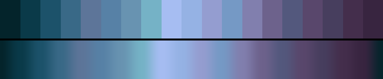

# P89 Driftwood & Slate

**Class** `earth` — Ochre, clay, moss, bark, stone. Warm-biased mid hues at low chroma and mid lightness -- the only class that is deliberately muted rather than dark or pale.

**Scheme** weathered blue-grey -> slate -> driftwood, all low chroma

## Mood
A grey beach in winter: bleached wood, wet slate, and the blue that only shows up when the light is flat.

## Look
The cold end of the earth family — the same muted mid-lightness construction as the warm earths, moved to the blue side, which no earth palette in the library has ever occupied.

## Pattern pairing
Terrain, sediment and crack patterns; cross-fades beautifully with the warm earth sets when the scheduler moves between them.

## Swatch

Top band: the 19 anchors. Bottom band: the cyclic ramp `gen_tables.py` expands from them.

## Class metrics

| metric | value | class target |
|---|---|---|
| `n` | 19 | · |
| `hue_bins` | 4 | · |
| `hue_arc` | 90.879 | 40 .. 160 |
| `accent_frac` | 0.326 | · |
| `C_mean` | 0.198 | · |
| `C_lit` | 0.209 | 0.12 .. 0.4 |
| `C_sd` | 0.031 | 0.0 .. 0.16 |
| `C_max` | 0.241 | · |
| `L_mean` | 0.527 | 0.38 .. 0.65 |
| `L_sd` | 0.163 | 0.12 .. 0.28 |
| `L_range` | 0.559 | · |
| `dark_frac` | 0.105 | · |
| `light_frac` | 0.0 | · |
| `neutral_frac` | 0.0 | · |
| `max_step` | 9.39 | · |
| `step_ratio` | 1.44 | 0 .. 2.4 |

Gate: **PASS** — fit=1.00 nn=house:ice d=0.222

## Colors (19)

`04242b` `0a3a49` `1c526a` `396987` `5d7599` `5781a6` `6893b1` `75b2c6` `a6bdf2` `95b2e4` `949dd0` `7599c5` `817fae` `6d628c` `53587d` `59476c` `473e5e` `442e4c` `382540`
