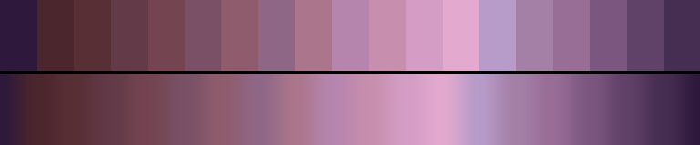

# P90 Mushroom & Mauve

**Class** `earth` — Ochre, clay, moss, bark, stone. Warm-biased mid hues at low chroma and mid lightness -- the only class that is deliberately muted rather than dark or pale.

**Scheme** mushroom -> mauve -> dusty rose, all low chroma

## Mood
A forager's basket in flat light: cap-brown, gill-grey, and the mauve that bruised mushrooms go.

## Look
Muted violet-reds inside a mid lightness band. Nothing here is black and nothing is pale, so it never reads as a value ramp — and it is the only earth in the library on the cool side of red.

## Pattern pairing
Texture, grain, erosion and sediment patterns. Stays legible under heavy layering where a saturated palette goes muddy.

## Swatch

Top band: the 19 anchors. Bottom band: the cyclic ramp `gen_tables.py` expands from them.

## Class metrics

| metric | value | class target |
|---|---|---|
| `n` | 19 | · |
| `hue_bins` | 3 | · |
| `hue_arc` | 54.737 | 40 .. 160 |
| `accent_frac` | 0.041 | · |
| `C_mean` | 0.216 | · |
| `C_lit` | 0.22 | 0.12 .. 0.4 |
| `C_sd` | 0.024 | 0.0 .. 0.16 |
| `C_max` | 0.254 | · |
| `L_mean` | 0.537 | 0.38 .. 0.65 |
| `L_sd` | 0.156 | 0.12 .. 0.28 |
| `L_range` | 0.54 | · |
| `dark_frac` | 0.053 | · |
| `light_frac` | 0.053 | · |
| `neutral_frac` | 0.0 | · |
| `max_step` | 8.71 | · |
| `step_ratio` | 1.43 | 0 .. 2.4 |

Gate: **PASS** — fit=1.00 nn=P76_claret_run d=0.246

## Colors (19)

`2e193c` `4b262c` `592f36` `623a48` `744550` `795066` `8f5c6d` `8f6786` `ab758c` `b685ad` `c78ead` `d49dc5` `e3a9cf` `b79bc9` `a480a7` `986d96` `7b577f` `604168` `462d52`
